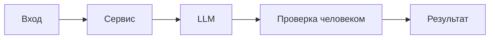

# ADR: решение для первого рабочего сценария

- Статус: proposed / accepted
 - Дата: Нет данных в CASE.md
 - Ответственные: Нет данных в CASE.md

## Контекст

Учебный кейс: AI-помощник ревьюера PR. Вход — TRAINING_PR.diff. Требуется вернуть summary, до 3 рисков с evidence и список checks. Применяются правила SEC-1, API-1, REL-1, OUT-1, SCOPE-1, QA-1, OBS-1. (Источник: CASE.md)

## Решение

Сформировать master prompt и Context Pack. В процессе: удалять секреты из diff перед LLM (SEC-1), отклонять слишком длинные диффы (API-1), обеспечивать формат OUT-1, включать риски только с evidence (QA-1), конвертировать таймауты LLM в контролируемый ответ (REL-1). (Источник: CASE.md)

## Рассмотренные альтернативы

| Альтернатива | Почему не выбрали сейчас |
|---|---|
| Избыточные внешние правила (auth, i18n) | Нет данных в CASE.md |

## Последствия и главный риск

- Положительные последствия:
  - Структурированный и проверяемый результат ревью (OUT-1).
- Ограничения:
  - Релевантность только в пределах CASE.md; не покрывает внешние требования.
- Главный риск:
  - Риски без достаточного evidence могут попасть в ответ при неверной фильтрации.
- Как проверим риск:
  - Проверка QA-1: для каждого риска требуем ссылку на diff/правило.

## Архитектурная схема

## Как использовали AI

- Для чего: зафиксировать архитектурное решение для первого сценария.
- Тип промпта: master prompt
- Строка в [`prompts.md`](prompts.md): P1-02
- Что проверили и исправили сами: проверили соответствие правилам SEC-1, API-1, REL-1, OUT-1, QA-1.
