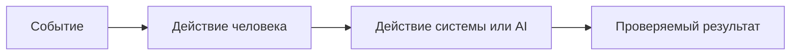

# Анализ процесса: AS IS и TO BE

## AS IS

Событие: получаем TRAINING_PR.diff.
Участники: человек-ревьюер (принимает решение), AI-помощник (выдаёт совет).
Процесс: помощник читает diff, формирует краткое описание, до 3 рисков с evidence и список проверок. Решение всегда принимает человек. (CASE.md: "Задача помощника", "Решение всегда принимает человек")
Ограничения: соблюдение правил OUT-1 (структура ответа), QA-1 (только подтверждённые риски), SCOPE-1 (только советы). (CASE.md: "Правила репозитория")

## TO BE

Процесс остаётся тем же, но явно соблюдает правила репозитория: фильтруем секреты (SEC-1) перед отправкой диффа в LLM, отклоняем слишком длинные диффы (API-1), соблюдаем формат OUT-1 и правило QA-1. Ошибки внешнего LLM конвертируются в контролируемый ответ (REL-1). (CASE.md)

## Разница

| Что меняется | AS IS | TO BE | Как проверим изменение |
|---|---|---|---|
| Формат результата | Может быть несогласованным | Строго OUT-1: summary, risks<=3, checks | Проверка структуры ответа |
| Подтверждённость рисков | Может содержать догадки | Только evidence из diff/правил (QA-1) | Наличие ссылок на diff/правила |
| Обработка больших диффов | Не определена | Отклонение >20000 символов (API-1) | Тест с длинным diff |
| Ошибки LLM | Не определены | Контролируемый ответ при timeout (REL-1) | Имитация таймаута |

## Как использовали AI

- Для чего: структурировать AS IS/TO BE на основе CASE.md.
- Тип промпта: master prompt
- Строка в [`prompts.md`](prompts.md): P1-02
- Что проверили и исправили сами: согласовали процесс с правилами SEC-1, API-1, REL-1, OUT-1, SCOPE-1, QA-1, OBS-1 из CASE.md.
