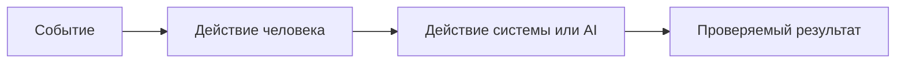
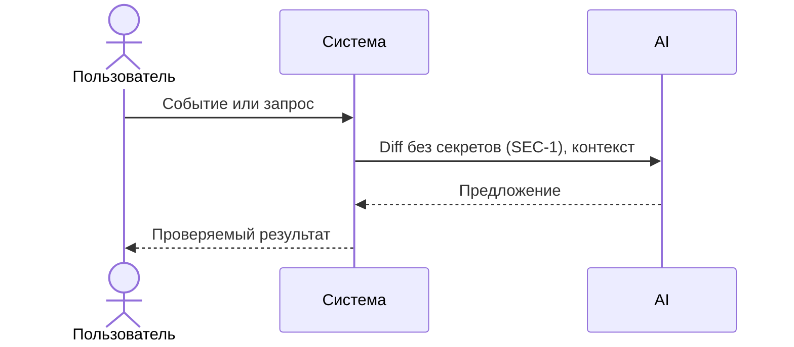
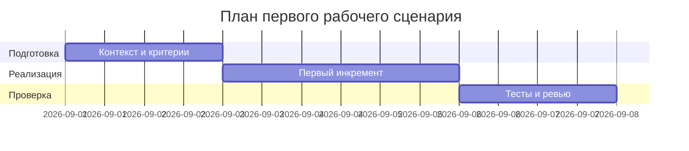
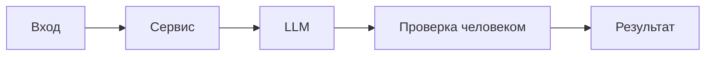

# Итоговый вывод

1. Список измененных файлов
   - practice_01/context.md
   - practice_01/problem.md
   - practice_01/analysis.md
   - practice_01/product_management.md
   - practice_01/project_management.md
   - practice_01/adr.md
   - practice_01/tests_unit.md
   - practice_01/tests_integration.md
   - practice_01/tests_e2e.md
   - practice_01/tests_load.md

2. Короткое резюме по изменениям
   - context.md: добавлены из CASE.md хороший/плохой пример и раздел использования AI; контекст и ограничения оставлены без изменений, опираются на CASE.md.
   - problem.md: проблема сформулирована в терминах CASE.md; метрики привязаны к OUT-1, QA-1, API-1; добавлен раздел использования AI.
   - analysis.md: описаны AS IS/TO BE с учетом правил SEC-1, API-1, REL-1, OUT-1, QA-1, SCOPE-1, OBS-1; таблица различий заполнена; добавлен раздел использования AI.
   - product_management.md: сформулирован первый сценарий, заполнен use case и user stories с acceptance; добавлен раздел использования AI.
   - project_management.md: расписаны инкременты, роли человека/AI и проверки; добавлен раздел использования AI.
   - adr.md: зафиксирован контекст и решение через master prompt/Context Pack, альтернативы и риск; добавлен раздел использования AI.
   - tests_unit.md: добавлены unit-проверки для OUT-1 и QA-1; добавлен раздел использования AI.
   - tests_integration.md: добавлены проверки REL-1 и ограничение рисков (OUT-1); добавлен раздел использования AI.
   - tests_e2e.md: добавлены позитивный и граничный сценарии (API-1); добавлен раздел использования AI.
   - tests_load.md: добавлен сценарий проверки API-1 на длину diff; добавлен раздел использования AI.

3. Риски (кандидат -> доказательство -> проверка)
   - Риск: в ответ попадут риски без доказательств -> Доказательство: CASE.md, правило QA-1 требует evidence из diff или правил -> Проверка: просмотреть сформированный ответ и убедиться, что каждый риск ссылается на строку diff или правило.
   - Риск: ответ не соответствует формату -> Доказательство: CASE.md, правило OUT-1 задает структуру summary, risks(<=3), checks -> Проверка: валидировать структуру результата на наличие всех полей и лимит числа рисков.
   - Риск: слишком длинные диффы не обрабатываются корректно -> Доказательство: CASE.md, правило API-1 предписывает 413 для diff > 20000 символов -> Проверка: отправить дифф длиной >20000 символов и ожидать отклонение по правилу.

## practice_01/context.md
```
# Контекст AS IS и Context Pack

## Продукт и команда сейчас

| Вопрос | Ответ | Источник или допущение |
|---|---|---|
| Какой продукт или сервис рассматриваем? | API-сервис, вызывающий LLM для ревью PR-диффов | TRAINING_PR.diff |
| Кто им пользуется? | Клиенты API (разработчики/внутренние сервисы), отправляющие diff | TRAINING_PR.diff |
| Как устроен текущий процесс? | POST /api/reviews принимает JSON с ключом "diff", передаёт в ReviewService, который формирует промпт и вызывает LLM.generate; возвращает {"comment": str} | TRAINING_PR.diff |
| Где возникает задержка или ошибка? | При отсутствии ключа "diff" — KeyError (500); при больших диффах — риск долгих ответов | TRAINING_PR.diff |
| Какие системы и команды участвуют? | FastAPI-приложение (app/api.py), ReviewService (app/review_service.py), абстракция LLM | TRAINING_PR.diff |

## Context Pack для первого рабочего сценария

### Факты и правила

- Эндпоинт: POST /api/reviews (sync) принимает payload: dict, используется ключ payload["diff"].
- ReviewService.review строит промпт: "Review this pull request and find problems:\n{diff}" и вызывает LLM.generate(prompt).
- Возвращаемый формат: dict {"comment": answer}.
- LLM — Protocol с методом generate(self, prompt: str) -> str.

### Формат входа и результата

- Вход: JSON объект с полем "diff": строка с содержимым PR diff.
- Результат: JSON {"comment": строка} — текст ответа LLM.

### Ограничения и запрещённые действия

- Нет схемы/валидации входа; отсутствие ключа "diff" приводит к KeyError.
- Нет ограничения длины/размера поля "diff".
- Промпт формируется прямой интерполяцией пользовательского ввода.

### Хороший пример

```text
app/review_service.py:16 — diff отправляется во внешний LLM без удаления секретов,
что нарушает SEC-1. Проверка: передать diff с тестовым token и убедиться,
что в prompt осталось [REDACTED].
```

### Плохой пример

```text
Код можно улучшить. Добавьте тесты и обработку ошибок.
```

### Что пока неизвестно

- Максимально допустимый размер diff.
- Таймауты/ретраи LLM.generate.
- Требования к аутентификации/авторизации.

## Как использовали AI

- Для чего: собрать Context Pack и зафиксировать факты/ограничения для TRAINING_PR.diff.
- Тип промпта: master prompt
- Строка в [`prompts.md`](prompts.md): P1-02
- Что проверили и исправили сами: сопоставили выводы с TRAINING_PR.diff; исключили внешние требования вне CASE.md.
```

## practice_01/problem.md
```
# Проблема и метрики

## Проблема

- Пользователь: ревьюер/сервис, использующий AI-помощника для анализа PR diff. (Источник: CASE.md, "Учебный кейс: AI-помощник ревьюера PR")
- Ситуация: на вход дается TRAINING_PR.diff, помощник должен вернуть краткое описание, риски (до 3) и список проверок. (Источник: CASE.md, "Задача помощника")
- Ограничения: соблюдение правил репозитория SEC-1, API-1, REL-1, OUT-1, SCOPE-1, QA-1, OBS-1. (Источник: CASE.md, "Правила репозитория")
- Что не входит в задачу: любые требования, не подтвержденные CASE.md (например, схемы БД, i18n). (Источник: CASE.md, раздел о правилах, которые не относятся к учебному PR)

## Метрики

Выберите измеримые показатели, относящиеся к проблеме. Не используйте VTG, IRR, WACC, CSAT или другую метрику только ради названия.

| Метрика | Текущее значение или способ замера | Целевое изменение | Когда измеряем | Источник данных |
|---|---:|---:|---|---|
| Соблюдение OUT-1 формата | Доля ответов, содержащих summary, risks (<=3) и checks | → 100% | На каждом запуске | Ответы помощника |
| Применение QA-1 | Доля рисков с явным evidence из diff или правил | → 100% | На каждом запуске | Ответы помощника и TRAINING_PR.diff |
| Обработка длинных диффов (API-1) | Ответ 413 при diff > 20000 символов | Соответствие правилу | При проверке граничного случая | Поведение сервиса/агента |

## Почему изменение метрики подтвердит решение проблемы

- Формат OUT-1 подтверждает, что результат структурирован и пригоден для ревью.
- Правило QA-1 гарантирует доказуемость каждого риска.
- Правило API-1 гарантирует предсказуемое поведение на больших входах.
## Как использовали AI

- Для чего: сформулировать проблему и измеримые критерии на основе CASE.md.
- Тип промпта: master prompt
- Строка в [`prompts.md`](prompts.md): P1-02
- Что проверили и исправили сами: проверили соответствие формата OUT-1 и ограничений QA-1/API-1 описанию в CASE.md.
```

## practice_01/analysis.md
```
# Анализ процесса: AS IS и TO BE

## AS IS

Событие: получаем TRAINING_PR.diff.
Участники: человек-ревьюер (принимает решение), AI-помощник (выдаёт совет).
Процесс: помощник читает diff, формирует краткое описание, до 3 рисков с evidence и список проверок. Решение всегда принимает человек. (CASE.md: "Задача помощника", "Решение всегда принимает человек")
Ограничения: соблюдение правил OUT-1 (структура ответа), QA-1 (только подтверждённые риски), SCOPE-1 (только советы). (CASE.md: "Правила репозитория")


## TO BE

Процесс остаётся тем же, но явно соблюдает правила репозитория: фильтруем секреты (SEC-1) перед отправкой диффа в LLM, отклоняем слишком длинные диффы (API-1), соблюдаем формат OUT-1 и правило QA-1. Ошибки внешнего LLM конвертируются в контролируемый ответ (REL-1). (CASE.md)



## Разница

| Что меняется | AS IS | TO BE | Как проверим изменение |
|---|---|---|---|
| Формат результата | Может быть несогласованным | Строго OUT-1: summary, risks<=3, checks | Проверка структуры ответа |
| Подтверждённость рисков | Может содержать догадки | Только evidence из diff/правил (QA-1) | Наличие ссылок на diff/правила |
| Обработка больших диффов | Не определена | Отклонение >20000 символов (API-1) | Тест с длинным diff |
| Ошибки LLM | Не определены | Контролируемый ответ при timeout (REL-1) | Имитация таймаута |

## Как использовали AI

- Для чего: структурировать AS IS/TO BE на основе CASE.md.
- Тип промпта: master prompt
- Строка в [`prompts.md`](prompts.md): P1-02
- Что проверили и исправили сами: согласовали процесс с правилами SEC-1, API-1, REL-1, OUT-1, SCOPE-1, QA-1, OBS-1 из CASE.md.
```

## practice_01/product_management.md
```
# Use cases и user stories

## Первый рабочий сценарий

**Когда** пользователю нужно проверить учебный PR, он передает TRAINING_PR.diff в помощника, **система** формирует результат по правилам OUT-1 (summary, до 3 risks с evidence, checks), **а пользователь получает** краткое описание, подтвержденные риски и список проверок. (Источник: CASE.md, "Задача помощника", OUT-1)

Не входит в этот сценарий:

- Правила, не относящиеся к учебному PR (например, i18n, схемы БД). (Источник: CASE.md)

## Use case

| Поле | Значение |
|---|---|
| Актор | Ревьюер/клиент API |
| Триггер | Появился TRAINING_PR.diff для проверки |
| Предусловия | Доступен diff; соблюдаем SEC-1 перед вызовом LLM |
| Основной результат | Ответ, соответствующий OUT-1: summary, risks<=3, checks |
| Ошибка или отказ | Если diff слишком длинный (>20000 симв.) — отклонить по API-1; при таймауте LLM — контролируемый ответ (REL-1) |



## User stories и acceptance criteria

```gherkin
Feature: Ревью учебного PR диффа

  Scenario: Позитивный
    Given доступен TRAINING_PR.diff
    When помощник формирует ответ
    Then результат содержит summary, не более 3 risks с evidence и checks (OUT-1)

  Scenario: Длинный дифф
    Given длина diff превышает 20000 символов
    When выполняется проверка входа
    Then запрос отклоняется согласно API-1
```

## Как использовали AI

- Для чего: описать сценарии и acceptance на базе правил из CASE.md.
- Тип промпта: master prompt
- Строка в [`prompts.md`](prompts.md): P1-02
- Что проверили и исправили сами: связали сценарии с правилами OUT-1, API-1, SEC-1, REL-1 из CASE.md.
```

## practice_01/project_management.md
```
# План поставки

## Инкременты и ответственность

| Инкремент | Наблюдаемый результат | Что делает человек | Что делает AI или субагент | Проверка | Зависимости |
|---|---|---|---|---|---|
| 1 | Контекст и проблема зафиксированы (context.md, problem.md) | Собирает факты из CASE.md | Предлагает структуру и проверки | Сопоставление с CASE.md | CASE.md |
| 2 | Master Prompt v1 собран (prompts.md) | Утверждает границы | Составляет контракт | Сравнение P1-01 vs P1-02 | context.md, problem.md |
| 3 | Проверки описаны (tests_*.md) | Определяет сценарии | Генерирует черновик критериев | Проверка формата и evidence | prompts.md |

## Диаграмма Ганта



Замените даты и задачи на свой план.

## Как использовали AI

- Для чего: сформировать инкременты и проверки по CASE.md.
- Тип промпта: master prompt
- Строка в [`prompts.md`](prompts.md): P1-02
- Что проверили и исправили сами: проверили связность между артефактами и правилами OUT-1, QA-1, API-1, REL-1.
```

## practice_01/adr.md
```
# ADR: решение для первого рабочего сценария

- Статус: proposed / accepted
- Дата: 2026-09-11
- Ответственные: Команда учебного проекта

## Контекст

Учебный кейс: AI-помощник ревьюера PR. Вход — TRAINING_PR.diff. Требуется вернуть summary, до 3 рисков с evidence и список checks. Применяются правила SEC-1, API-1, REL-1, OUT-1, SCOPE-1, QA-1, OBS-1. (Источник: CASE.md)

## Решение

Сформировать master prompt и Context Pack. В процессе: удалять секреты из diff перед LLM (SEC-1), отклонять слишком длинные диффы (API-1), обеспечивать формат OUT-1, включать риски только с evidence (QA-1), конвертировать таймауты LLM в контролируемый ответ (REL-1). (Источник: CASE.md)

## Рассмотренные альтернативы

| Альтернатива | Почему не выбрали сейчас |
|---|---|
| Избыточные внешние правила (auth, i18n) | Нет данных в CASE.md |

## Последствия и главный риск

- Положительные последствия:
  - Структурированный и проверяемый результат ревью (OUT-1).
- Ограничения:
  - Релевантность только в пределах CASE.md; не покрывает внешние требования.
- Главный риск:
  - Риски без достаточного evidence могут попасть в ответ при неверной фильтрации.
- Как проверим риск:
  - Проверка QA-1: для каждого риска требуем ссылку на diff/правило.

## Архитектурная схема



## Как использовали AI

- Для чего: зафиксировать архитектурное решение для первого сценария.
- Тип промпта: master prompt
- Строка в [`prompts.md`](prompts.md): P1-02
- Что проверили и исправили сами: проверили соответствие правилам SEC-1, API-1, REL-1, OUT-1, QA-1.
```

## practice_01/tests_unit.md
```
# Unit-проверки

| Требование или правило | Что проверяем изолированно | Вход | Ожидаемый результат | Evidence |
|---|---|---|---|---|
| OUT-1: структура ответа | Валидация полей summary/risks/checks | Модель ответа | Проходит валидация, не больше 3 рисков | CASE.md: OUT-1 |
| QA-1: evidence обязателен | Фильтрация рисков без evidence | Риск без ссылки на diff/правило | Риск отклонен | CASE.md: QA-1 |

## Как использовали AI

- Строка в [`prompts.md`](prompts.md): P1-02
- Что проверили и исправили сами: сопоставили тестовые правила с CASE.md.
```

## practice_01/tests_integration.md
```
# Integration-проверки

| Связь компонентов | Что может сломаться | Как воспроизводим | Ожидаемый результат | Evidence |
|---|---|---|---|---|
| Помощник -> LLM | Таймаут внешнего LLM | Смоделировать таймаут | Контролируемый ответ (REL-1) | CASE.md: REL-1 |
| Формирование ответа -> Валидатор | Превышено число рисков | Передать 4 риска | Отклонение лишних рисков | CASE.md: OUT-1 |

## Как использовали AI

- Строка в [`prompts.md`](prompts.md): P1-02
- Что проверили и исправили сами: связали интеграции с правилами OUT-1 и REL-1.
```

## practice_01/tests_e2e.md
```
# E2E-проверки

| Сценарий пользователя | Предусловия | Действие | Наблюдаемый результат | Evidence |
|---|---|---|---|---|
| Позитивный | Доступен TRAINING_PR.diff | Запрос на ревью | Ответ в формате OUT-1 | CASE.md: OUT-1 |
| Негативный | Нет diff | Выполнить запрос | Нет данных в CASE.md | Нет данных в CASE.md |
| Граничный | diff > 20000 символов | Выполнить запрос | Отклонение (API-1) | CASE.md: API-1 |

## Как использовали AI

- Строка в [`prompts.md`](prompts.md): P1-02
- Что проверили и исправили сами: проверили сопоставление сценариев с OUT-1 и API-1.
```

## practice_01/tests_load.md
```
# Нагрузочные проверки

| Сценарий | Нагрузка и длительность | Допустимый предел | Что измеряем | Evidence |
|---|---|---|---|---|
| Длинные диффы | Постепенно увеличивать размер diff | Отклонение при >20000 символов | Соответствие API-1 | CASE.md: API-1 |

Если нагрузочное тестирование пока не требуется, обоснуйте это и назовите условие, после которого оно понадобится.

## Как использовали AI

- Строка в [`prompts.md`](prompts.md): P1-02
- Что проверили и исправили сами: связали сценарий с правилом API-1.
```
