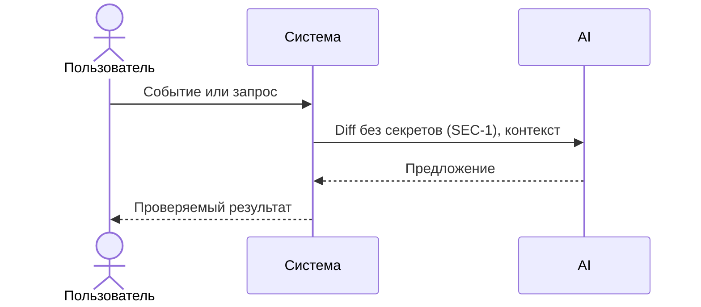

# Use cases и user stories

Файл ведёт OpenCode. Обсудите с агентом содержание и проверьте предложенный diff. Все дополнения и исправления поручайте агенту в чате.

## Первый рабочий сценарий

**Когда** пользователю нужно проверить учебный PR, он передает TRAINING_PR.diff в помощника, **система** формирует результат по правилам OUT-1 (summary, до 3 risks с evidence, checks), **а пользователь получает** краткое описание, подтвержденные риски и список проверок. (Источник: CASE.md, "Задача помощника", OUT-1)

Не входит в этот сценарий:

- Правила, не относящиеся к учебному PR (например, i18n, схемы БД). (Источник: CASE.md)

## Use case

| Поле | Значение |
|---|---|
| Актор | Ревьюер/клиент API |
| Триггер | Появился TRAINING_PR.diff для проверки |
| Предусловия | Доступен diff; соблюдаем SEC-1 перед вызовом LLM |
| Основной результат | Ответ, соответствующий OUT-1: summary, risks<=3, checks |
| Ошибка или отказ | Если diff слишком длинный (>20000 симв.) — отклонить по API-1; при таймауте LLM — контролируемый ответ (REL-1) |



## User stories и acceptance criteria

```gherkin
Feature: Ревью учебного PR диффа

  Scenario: Позитивный
    Given доступен TRAINING_PR.diff
    When помощник формирует ответ
    Then результат содержит summary, не более 3 risks с evidence и checks (OUT-1)

  Scenario: Длинный дифф
    Given длина diff превышает 20000 символов
    When выполняется проверка входа
    Then запрос отклоняется согласно API-1
```

## Как использовали AI

- Для чего: описать сценарии и acceptance на базе правил из CASE.md.
- Тип промпта: master prompt
- Строка в [`prompts.md`](prompts.md): P1-02
- Что проверили и исправили сами: связали сценарии с правилами OUT-1, API-1, SEC-1, REL-1 из CASE.md.
