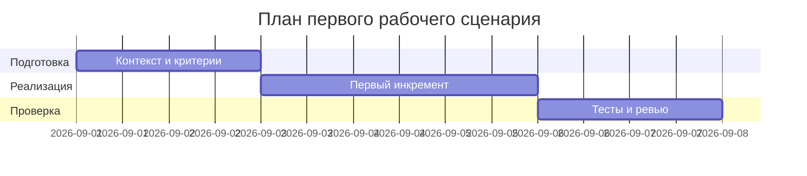

# План поставки

Файл ведёт OpenCode. Обсудите с агентом содержание и проверьте предложенный diff. Все дополнения и исправления поручайте агенту в чате.

## Инкременты и ответственность

| Инкремент | Наблюдаемый результат | Что делает человек | Что делает AI или субагент | Проверка | Зависимости |
|---|---|---|---|---|---|
| 1 | Контекст и проблема зафиксированы (context.md, problem.md) | Собирает факты из CASE.md | Предлагает структуру и проверки | Сопоставление с CASE.md | CASE.md |
| 2 | Master Prompt v1 собран (prompts.md) | Утверждает границы | Составляет контракт | Сравнение P1-01 vs P1-02 | context.md, problem.md |
| 3 | Проверки описаны (tests_*.md) | Определяет сценарии | Генерирует черновик критериев | Проверка формата и evidence | prompts.md |

## Диаграмма Ганта

Передайте OpenCode даты и задачи своего плана и попросите обновить диаграмму.

## Как использовали AI

- Для чего: сформировать инкременты и проверки по CASE.md.
- Тип промпта: master prompt
- Строка в [`prompts.md`](prompts.md): P1-02
- Что проверили и исправили сами: проверили связность между артефактами и правилами OUT-1, QA-1, API-1, REL-1.
